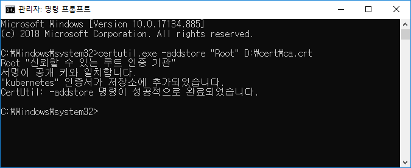
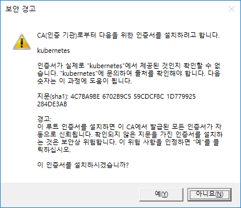
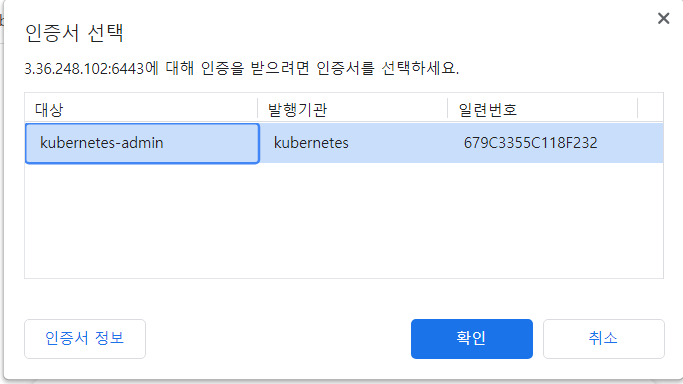
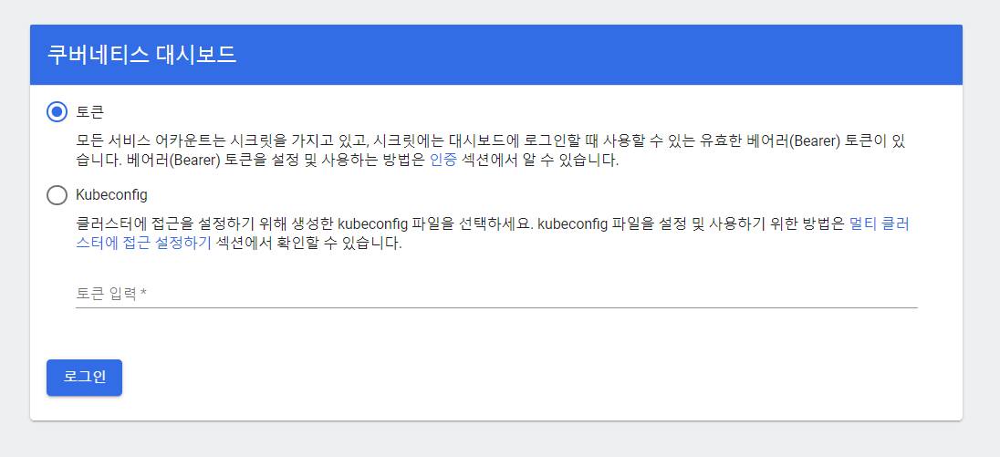
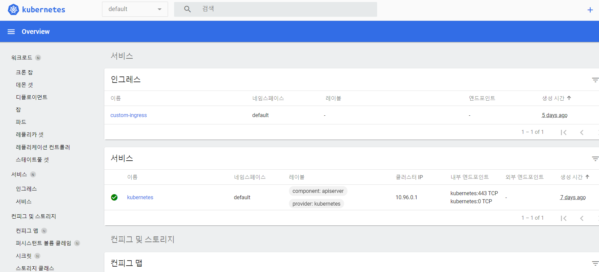

# Kubernetes 접속 정보

현재 저희가 할당받은 AWS 공간은 WEB(서버1번), WAS(서버2번), RDS 이렇게 입니다.

이를 활용하여 WEB에 K8S 마스터 노드를 WAS에 K8S 워커 노드를 구성한 상태입니다.

ssh에 접속해서 su - root 해서 root 계정으로 전환하신다음에 kubectl 명령을 사용하면 쿠버네티스 명령 수행이 가능합니다.

## Kubernetes Dashboard 접속 정보

저희는 openshift나 fying cube 사용이 안되므로 쿠버네티스에서 제공하는 유사한 기능의 Kubernetes Dashboard를 설치하였습니다.

로컬에서 Kubernetes Dashboard 접속을 위해서는 아래와 같은 작업이 필요합니다.

1. ca.crt 인증서 로컬 적용
   slack에 ca.crt 인증서를 올려두었습니다. 해당 인증서를 로컬 PC 명령창(윈도우 powershell 추천)에서 아래와 같이 실행하여 적용합니다.

   

2. 마찬가지로 로컬 PC 명령창에서 다음 명령어로  개인용 인증서를 적용합니다.
   certutil.exe -p New1234! -user -importPFX c:\ca\kubecfg.p12

   위 명령어 입력 시 아래와 같은 인증서 설치 여부를 묻게 되며 예를 선택하면 모든 준비가 완료됩니다. 

   

3. 다음 URL로 접속하여 쿠버네티스 대시보드에 접근합니다.

   https://3.36.248.102:6443/api/v1/namespaces/kubernetes-dashboard/services/https:kubernetes-dashboard:/proxy/#/overview?namespace=default
   접속하면 아래와 같이 인증서를 선택하라고 나오며 '확인'을 누릅니다.
   

4. 그럼 아래와 같이 토큰을 입력하라고 나옵니다.
   

   토큰은 slack에 올려두었습니다. 토큰을 입력하고 로그인을 합니다.

그럼 아래와 같이 접속이 가능합니다.

